# ⚡ 520 kW Grid-Connected PV Microgrid with MPPT & Battery Energy Management System

<p align="center">
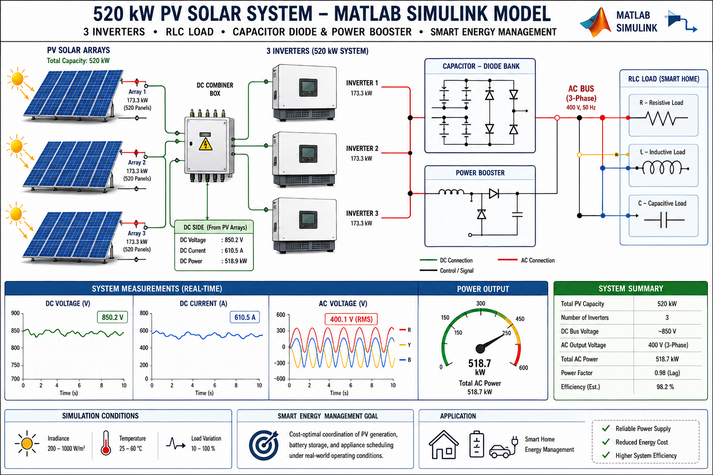
</p>

<p align="center">


</p>

<p align="center">

A comprehensive MATLAB/Simulink implementation of a **520 kW utility-scale photovoltaic microgrid** integrating **real PV array modeling, MPPT control, power electronics, battery energy storage, and intelligent energy management**.

</p>

---

# ⭐ Highlights

✔ 520.3 kW Utility-Scale Solar PV Plant

✔ MATLAB & Simulink (Simscape Electrical)

✔ Three Independent PV Generation Chains

✔ Real Manufacturer PV Module Parameters

✔ Custom Perturb & Observe (P&O) MPPT

✔ DC-DC Boost Converter Design

✔ Three-Phase Voltage Source Inverter (VSI)

✔ LC Output Filter

✔ Transformer Interface

✔ Battery Energy Storage System (BESS)

✔ Intelligent Energy Management System (EMS)

✔ Time-of-Use Tariff Optimization

✔ Smart Appliance Scheduling

✔ Grid Import / Export Analysis

✔ Engineering Verification & Validation

✔ Complete Technical Report Included

---

# 📖 Table of Contents

- [Project Overview](#-project-overview)
- [Objectives](#-project-objectives)
- [Key Features](#-key-features)
- [Project Overview Diagram](#-project-overview-diagram)
- [System Architecture](#-system-architecture)
- [PV Plant Design](#-pv-plant-design)
- [Single PV Conversion Chain](#-single-pv-conversion-chain)
- [Perturb & Observe MPPT](#-perturb--observe-mppt)
- [Boost Converter Design](#-boost-converter-design)
- [Three-Phase Inverter](#-three-phase-voltage-source-inverter)
- [LC Filter & Transformer](#-lc-filter-and-transformer)
- [Verification Methodology](#-verification-methodology)
- [Simulation Results](#-simulation-results)
- [Energy Management System](#-energy-management-system)
- [Battery Energy Storage](#-battery-energy-storage)
- [Battery State of Charge](#-battery-state-of-charge)
- [Time-of-Use Tariff](#-time-of-use-electricity-tariff)
- [EMS Decision Logic](#-ems-decision-logic)
- [Flexible Appliance Scheduling](#-flexible-appliance-scheduling)
- [Signal Flow](#-complete-signal-flow)
- [Grid Import & Export](#-grid-import--export)
- [Cost Comparison](#-cost-comparison)
- [Performance Summary](#-performance-summary)
- [Key Findings](#-key-findings)
- [Research Contribution](#-research-contribution)
- [Future Work](#-future-work)
- [Repository Structure](#-repository-structure)
- [Requirements](#-requirements)
- [Running the Models](#-running-the-models)
- [Technical Report](#-technical-report)
- [Technologies Used](#-technologies-used)
- [Keywords](#-keywords)
- [Author](#-author)
- [License](#-license)

---

# 📌 Project Overview

This repository presents the **design, simulation, verification, and performance evaluation** of a **520.3 kW Grid-Connected Photovoltaic (PV) Microgrid** developed using **MATLAB/Simulink** and **Simscape Electrical (Specialized Power Systems)**.

Unlike conventional simulation projects that focus only on producing output waveforms, this work follows a **verification-first engineering methodology**, where every major subsystem is validated against theoretical equations, engineering principles, and independent measurement techniques before integration into the complete system.

The project combines two major research components:

## ☀️ Circuit-Level PV Power Plant

A detailed switching-level photovoltaic generation system including:

- Real PV Array Modeling
- P&O Maximum Power Point Tracking
- DC-DC Boost Converters
- DC Link
- Three-Phase Voltage Source Inverters
- LC Filters
- Step-Up Transformer
- AC Bus Integration

---

## 🔋 Intelligent Energy Management System

A separate 24-hour Energy Management System (EMS) was developed to optimize residential energy consumption using:

- Battery Energy Storage
- State of Charge Monitoring
- Time-of-Use Tariff
- Flexible Appliance Scheduling
- Grid Import / Export Analysis
- Smart Battery Dispatch
- Cost Optimization

The EMS operates independently from the detailed switching model and evaluates daily system performance under realistic operating conditions.

---

# 🎯 Project Objectives

The primary objectives of this project include:

- Design a realistic utility-scale PV generation system.
- Develop a detailed MATLAB/Simulink implementation.
- Use real manufacturer PV module parameters.
- Implement a custom Perturb & Observe MPPT algorithm.
- Validate boost converter operation using theoretical equations.
- Design a three-phase inverter system.
- Improve output power quality using LC filters.
- Interface the inverter through a transformer.
- Investigate converter efficiency.
- Analyze AC-side power delivery.
- Develop a battery energy management strategy.
- Implement Time-of-Use tariff optimization.
- Schedule household appliances intelligently.
- Evaluate battery State of Charge behavior.
- Perform engineering fault diagnosis.
- Document system limitations and future improvements.

---

# 🚀 Key Features

| Feature | Description |
|----------|-------------|
| PV Plant Capacity | 520.3 kW |
| Simulation Platform | MATLAB / Simulink |
| Electrical Library | Simscape Electrical |
| MPPT Technique | Perturb & Observe |
| Converter | DC-DC Boost |
| Inverter | Three-Phase VSI |
| Grid Interface | Transformer Coupled |
| Battery Capacity | 2000 kWh |
| EMS | Rule-Based |
| Tariff | Time-of-Use |
| Scheduling | Intelligent |
| Validation | Theoretical + Simulation |
| Documentation | Complete Technical Report |

---

# 🖼️ Project Overview Diagram

<p align="center">
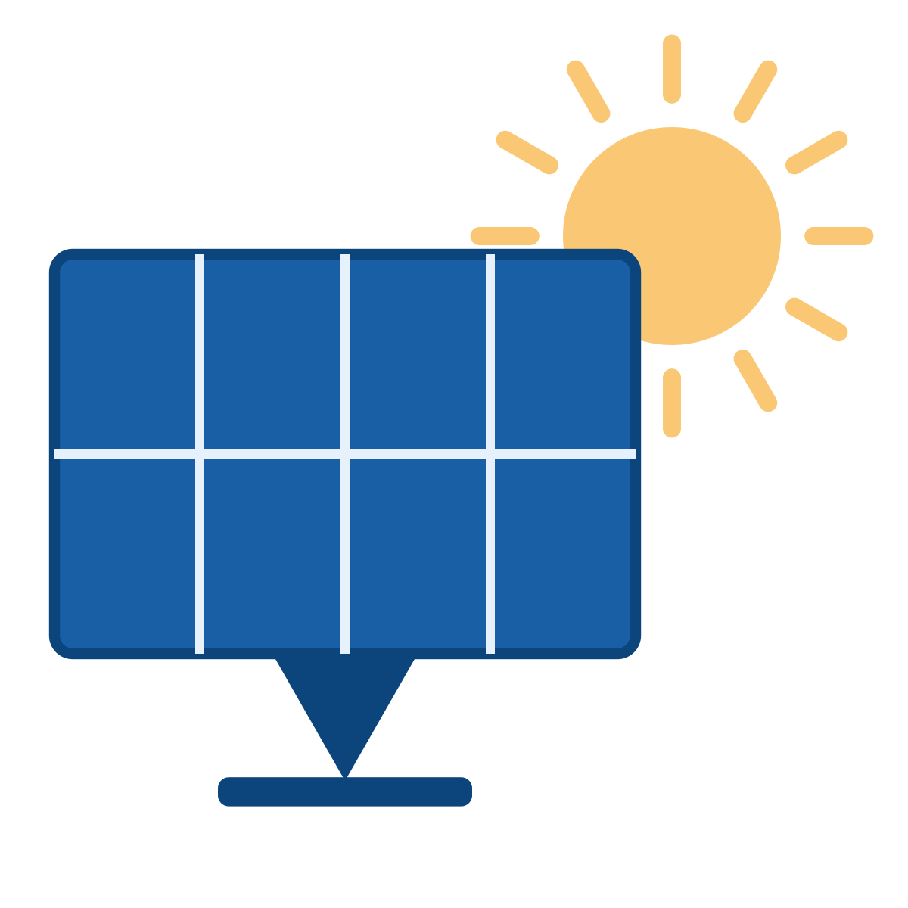
</p>

The figure above provides a high-level overview of the complete photovoltaic microgrid developed in this repository. It illustrates the interaction between the photovoltaic generation system, battery energy storage, intelligent Energy Management System (EMS), and utility grid. The project combines power electronics, renewable energy integration, and smart energy management into a unified simulation framework.

---

## 📈 Why This Project?

The transition toward renewable energy requires intelligent systems capable of efficiently integrating intermittent solar generation with modern electrical grids. This project demonstrates how photovoltaic generation, battery energy storage, and smart energy management can be combined into a realistic and scalable microgrid architecture.

By integrating power electronics, control systems, and optimization strategies, the model serves as both an educational resource and a foundation for future research in renewable energy systems, smart grids, and intelligent energy management.
# 🏗️ System Architecture

The proposed photovoltaic microgrid consists of **three identical PV generation subsystems** connected in parallel to a common AC bus. Each subsystem independently converts solar energy into grid-compatible AC power through multiple stages of power electronic conversion.

The overall architecture includes:

- Photovoltaic Arrays
- MPPT Controller
- DC–DC Boost Converter
- DC Link
- Three-Phase Voltage Source Inverter
- LC Output Filter
- Step-Up / Isolation Transformer
- Common AC Bus
- Utility Grid / Local Load

The modular architecture enables scalability, redundancy, and easier subsystem verification.

<p align="center">
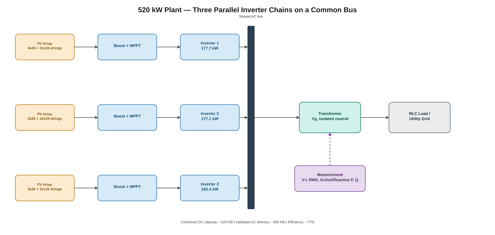
</p>

**Figure:** Complete architecture of the proposed 520 kW photovoltaic microgrid.

---

# ⚡ Single PV Conversion Chain

Each photovoltaic subsystem follows the same electrical topology.

<p align="center">
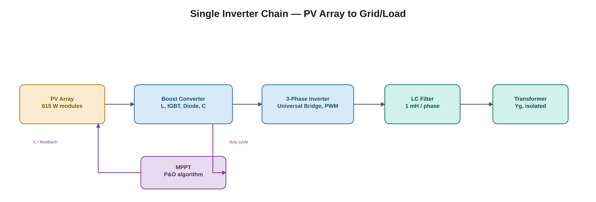
</p>

Each chain consists of:

```text
Solar Irradiance
        │
        ▼
    PV Array
        │
        ▼
Voltage & Current Measurement
        │
        ▼
 P&O MPPT Controller
        │
        ▼
 DC–DC Boost Converter
        │
        ▼
      DC Link
        │
        ▼
Three-Phase Inverter
        │
        ▼
     LC Filter
        │
        ▼
Isolation Transformer
        │
        ▼
     Common AC Bus
```

The three identical chains operate simultaneously and share the generated active power through a common AC bus.

---

# ☀️ Photovoltaic Array Design

The PV system was designed using the **Jinko Solar Tiger Neo N-Type 78HL4 615 W** photovoltaic module.

Unlike simplified educational models, the simulation uses **manufacturer datasheet parameters**, allowing the generated power to closely represent a practical utility-scale solar installation.

## PV Module Specifications

| Parameter | Value |
|------------|-------|
| Rated Power | 615 W |
| Open Circuit Voltage (Voc) | 56.25 V |
| Short Circuit Current (Isc) | 13.80 A |
| Maximum Power Voltage (Vmp) | 46.81 V |
| Maximum Power Current (Imp) | 13.14 A |

---

## PV Plant Configuration

The plant is divided into three independent inverter groups.

| Inverter | 20-Module Strings | 19-Module Strings | Rated Power |
|-----------|------------------:|------------------:|------------:|
| Inverter 1 | 4 | 11 | 177.7 kW |
| Inverter 2 | 3 | 12 | 177.1 kW |
| Inverter 3 | 3 | 11 | 165.4 kW |
| **Total** | **10** | **34** | **520.3 kW** |

Overall plant characteristics:

- 44 PV strings
- Three inverter stations
- Approximate DC capacity of **520.3 kW**

The modular arrangement improves scalability and allows each inverter subsystem to operate independently while contributing to the common AC bus.

---

# ☀️ Perturb & Observe (P&O) Maximum Power Point Tracking

Maximum Power Point Tracking (MPPT) is essential for extracting the maximum available energy from photovoltaic modules under changing environmental conditions.

A **custom Perturb & Observe (P&O)** algorithm was developed using MATLAB Function blocks rather than relying on pre-built Simulink MPPT libraries.

<p align="center">
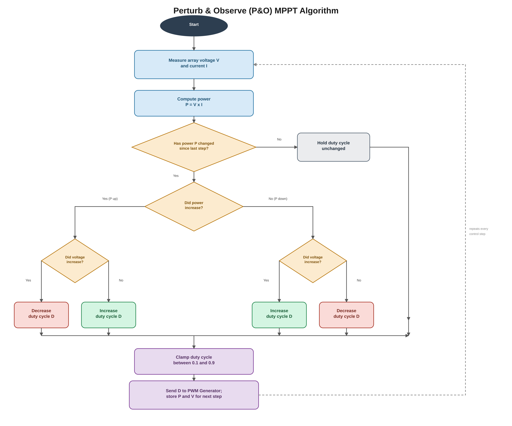
</p>

The controller performs the following sequence:

1. Measure PV voltage and current.
2. Calculate instantaneous output power.
3. Compare present power with previous iteration.
4. Determine perturbation direction.
5. Modify boost converter duty cycle.
6. Repeat continuously until convergence.

---

## MPPT Verification

To verify the controller, the solar irradiance was intentionally changed during simulation.

```text
1000 W/m²
      │
      ▼
600 W/m²
```

Following the irradiance transition, the controller successfully converged toward the new maximum power operating point without instability.

This confirms that the implemented algorithm performs genuine closed-loop MPPT rather than operating with a fixed duty ratio.

---

# ⚡ DC–DC Boost Converter

The boost converter raises the PV output voltage to the required DC-link voltage before inversion.

The converter operates using Pulse Width Modulation (PWM), where the duty cycle is supplied by the MPPT controller.

For Continuous Conduction Mode (CCM), the theoretical voltage relationship is

\[
V_{out}=\frac{V_{in}}{1-D}
\]

where

- \(V_{in}\) = PV input voltage
- \(V_{out}\) = Output voltage
- \(D\) = Duty cycle

---

## Converter Verification

Instead of accepting simulation outputs directly, converter performance was verified against theoretical calculations.

An unexpected discrepancy between theoretical and simulated output voltage revealed that the converter was operating in **Discontinuous Conduction Mode (DCM)**.

Root cause:

- Inductor too small

Correction:

```text
Original Inductor = 0.5 mH

↓

Revised Inductor = 5 mH
```

Following the redesign, the simulated output voltage closely matched theoretical predictions, with an error generally below **3%**.

This demonstrates the importance of combining theoretical analysis with simulation during engineering design.

---

# ⚡ Three-Phase Voltage Source Inverter

The regulated DC voltage is converted into three-phase AC power using a Voltage Source Inverter (VSI).

The inverter performs:

- DC-to-AC conversion
- Sinusoidal PWM switching
- Three-phase balanced output generation
- Grid-compatible frequency production

The inverter serves as the interface between the DC photovoltaic system and the AC network.

---

# 🔌 LC Output Filter

Switching inverters inherently generate high-frequency harmonics.

An LC output filter was designed to:

- Reduce switching ripple
- Improve waveform quality
- Reduce Total Harmonic Distortion (THD)
- Deliver nearly sinusoidal voltages and currents

Proper filter design significantly improves inverter output quality before connection to the transformer.

---

# 🔄 Transformer Interface

Each inverter is connected to the AC bus through an isolation transformer.

The transformer provides:

- Electrical isolation
- Ground reference
- Voltage matching
- Improved measurement stability

The grounded-wye transformer configuration also resolved an AC measurement reference issue encountered during early simulation stages.

---

# 🔬 Verification Methodology

One of the most significant contributions of this work is the adoption of a **verification-first engineering workflow**.

Rather than relying solely on simulation outputs, each subsystem was independently verified before system integration.

The validation process consisted of:

```text
Theory
   │
   ▼
Mathematical Analysis
   │
   ▼
Component Design
   │
   ▼
Simulation
   │
   ▼
Independent Verification
   │
   ▼
Fault Detection
   │
   ▼
Root Cause Analysis
   │
   ▼
Engineering Correction
   │
   ▼
Integrated System Validation
```

Subsystem verification included:

✅ PV array sizing

✅ Boost converter equations

✅ MPPT convergence

✅ AC power calculations

✅ Transformer operation

✅ Grid synchronization analysis

✅ Battery dispatch logic

This methodology significantly increases confidence in the reported simulation results and distinguishes the project from conventional simulation-only studies.
# 📊 Simulation Results

The proposed photovoltaic microgrid was evaluated using detailed MATLAB/Simulink simulations under realistic environmental and operating conditions.

The simulation verifies both the electrical performance of the PV generation system and the effectiveness of the Energy Management System (EMS).

---

# ☀️ PV Generation vs Load Profile

<p align="center">
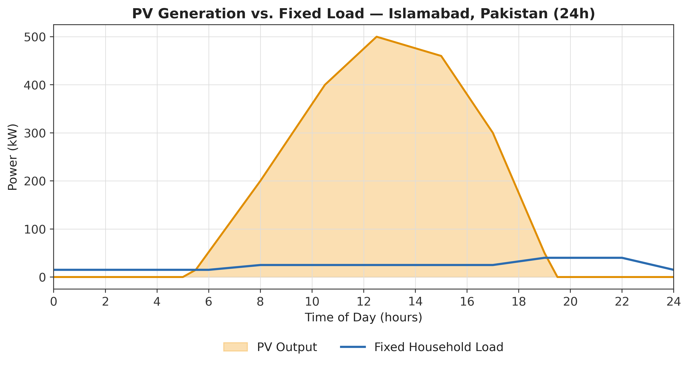
</p>

The figure illustrates the daily relationship between photovoltaic generation and household demand.

### Observations

- PV generation begins shortly after sunrise.
- Maximum power is produced around solar noon.
- PV output decreases gradually toward sunset.
- Midday PV production exceeds household demand.
- Excess energy is stored in the battery or exported to the utility grid.
- During evening hours, battery storage supports the load when solar generation is unavailable.

This complementary relationship between solar production and battery storage forms the foundation of the proposed EMS.

---

# 🔋 Energy Management System (EMS)

The second phase of this project focuses on intelligent energy management.

A separate 24-hour discrete-time simulation was developed to optimize energy usage using battery storage, Time-of-Use electricity pricing, and flexible appliance scheduling.

<p align="center">
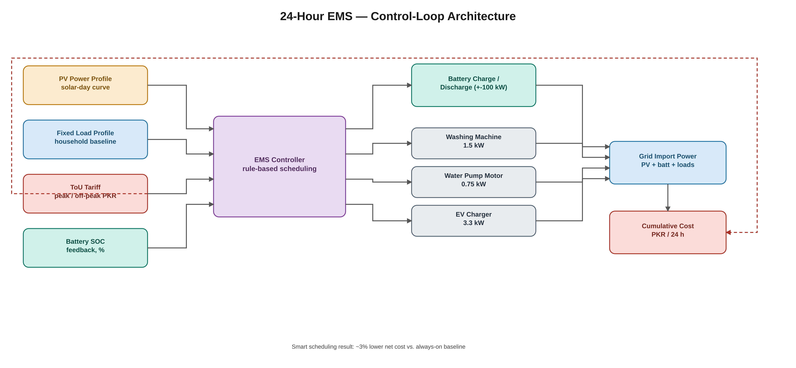
</p>

The EMS continuously monitors:

- PV generation
- Household demand
- Battery State of Charge (SOC)
- Electricity tariff
- Time of day
- Appliance operating conditions

Based on these parameters, the controller determines the most economical operating strategy.

---

# 🔋 Battery Energy Storage System (BESS)

Battery storage enables excess daytime solar energy to be utilized during low-generation periods.

## Battery Specifications

| Parameter | Value |
|-----------|------:|
| Battery Capacity | 2000 kWh |
| Maximum Charge Rate | 100 kW |
| Maximum Discharge Rate | 100 kW |
| Initial SOC | Configurable |
| SOC Limits | 0–100% |
| Simulation Resolution | 1 minute |
| Simulation Duration | 24 Hours |

The battery controller prevents overcharging and excessive discharge while maximizing renewable energy utilization.

---

# 🔋 Battery State of Charge

<p align="center">
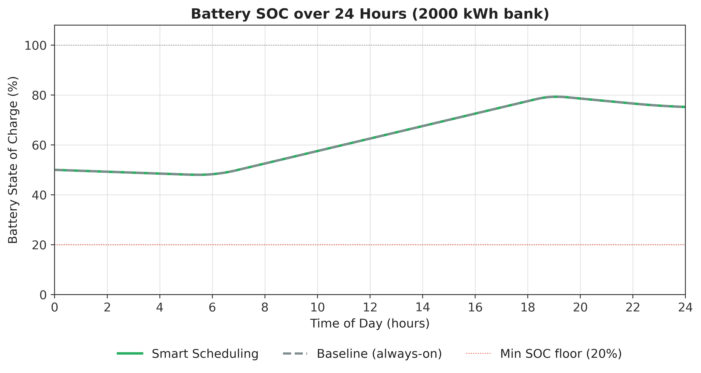
</p>

The figure illustrates battery charging and discharging behavior throughout the day.

### Charging Period

Battery charging primarily occurs during:

- High solar irradiance
- Low household demand
- Off-peak electricity pricing

### Discharging Period

Battery discharge occurs when:

- Solar generation decreases
- Evening load increases
- Peak electricity tariff becomes active

The battery therefore reduces dependence on the utility grid during expensive operating periods.

---

# 💰 Time-of-Use Electricity Tariff

Electricity pricing strongly influences EMS decision making.

<p align="center">
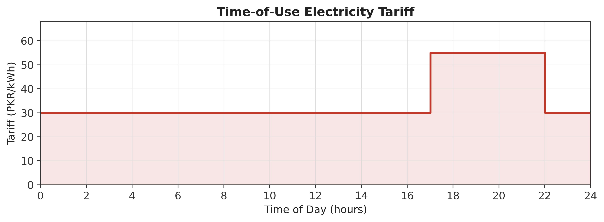
</p>

The implemented tariff model consists of:

| Time Period | Electricity Price |
|-------------|-----------------:|
| Off-Peak | 30 PKR/kWh |
| Peak (17:00–22:00) | 55 PKR/kWh |

The EMS schedules charging and flexible appliance operation to minimize electricity expenditure while maximizing utilization of locally generated photovoltaic energy.

---

# 🧠 EMS Decision Logic

A rule-based decision-making algorithm supervises the operation of the entire energy management system.

<p align="center">
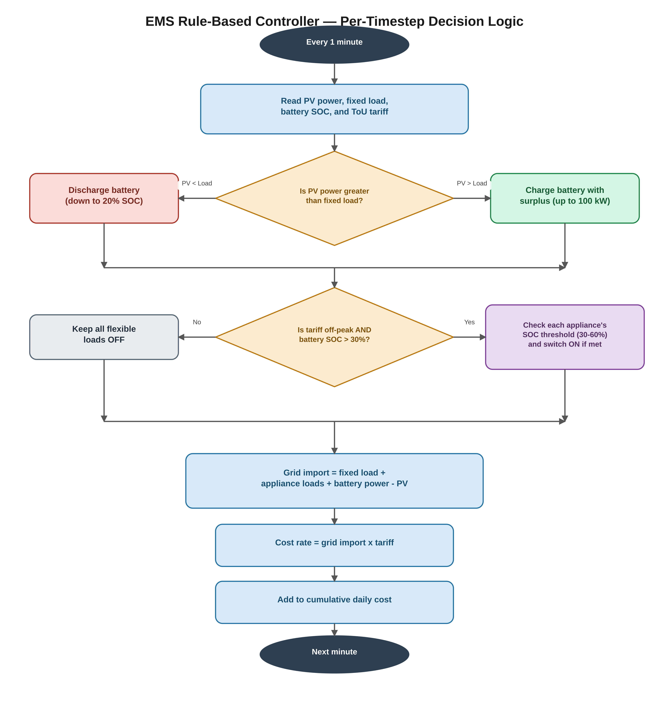
</p>

The controller evaluates:

- Current Battery SOC
- PV Generation
- Load Demand
- Utility Tariff
- Appliance Requests

Based on these inputs, the EMS determines whether to:

- Charge the battery
- Discharge the battery
- Import energy
- Export energy
- Schedule flexible appliances
- Delay appliance operation

The objective is to minimize operating cost while maintaining uninterrupted power supply.

---

# 🏠 Intelligent Appliance Scheduling

Several household appliances were considered flexible loads.

<p align="center">
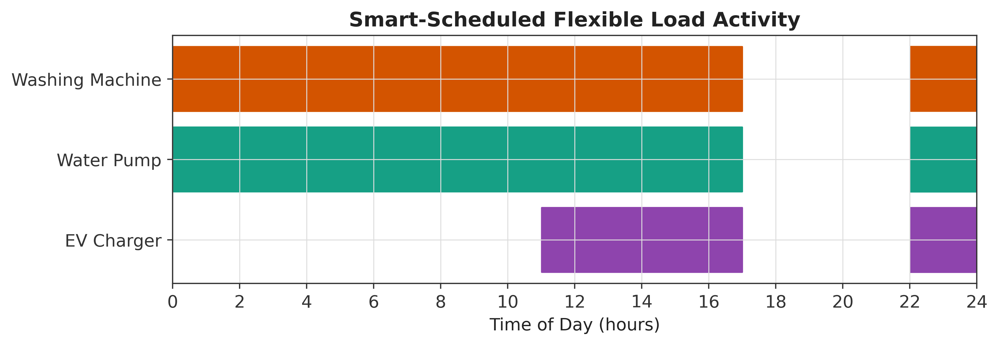
</p>

### Modeled Flexible Loads

| Appliance | Rated Power |
|-----------|------------:|
| Washing Machine | 1.5 kW |
| Water Pump | 0.75 kW |
| EV Charger | 3.3 kW |

Rather than operating immediately after user request, these appliances are automatically scheduled during periods of:

- High PV generation
- Sufficient Battery SOC
- Low electricity tariff

This significantly improves energy utilization and reduces operating cost.

---

# 🔄 Complete Signal Flow

The interaction among all EMS components is summarized below.

<p align="center">
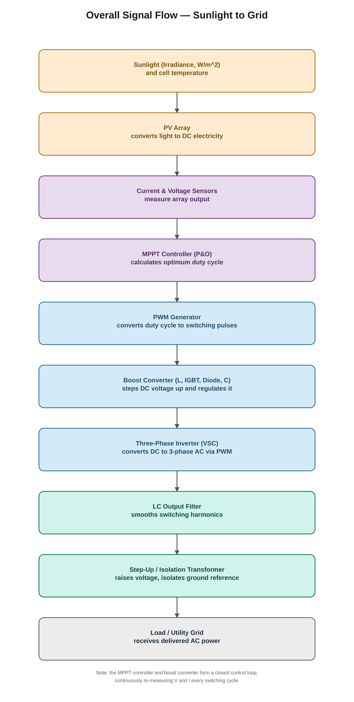
</p>

The controller continuously exchanges information between:

- PV Generation
- Battery Storage
- Household Load
- Flexible Appliances
- Electricity Tariff
- Utility Grid

This coordinated information flow enables intelligent real-time energy management.

---

# ⚡ Utility Grid Interaction

The EMS continuously determines whether energy should be imported from or exported to the electrical grid.

<p align="center">
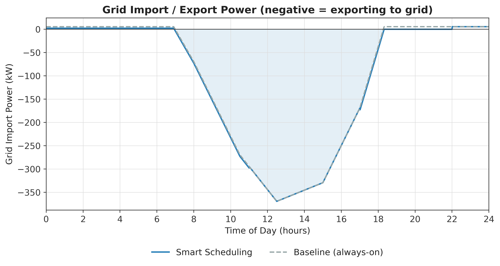
</p>

Grid power depends upon the instantaneous balance between:

```text
PV Generation
      +
Battery Power
      -
Load Demand
      =
Grid Import / Export
```

### Import Mode

Occurs when:

- PV generation is insufficient.
- Battery SOC is low.
- Household demand exceeds available renewable energy.

### Export Mode

Occurs when:

- PV generation exceeds demand.
- Battery reaches its charging limit.
- Excess renewable energy is available.

This dynamic interaction maximizes renewable energy utilization while reducing unnecessary grid dependence.

---

# 💵 Economic Performance

The proposed EMS was compared against a conventional operating strategy.

<p align="center">
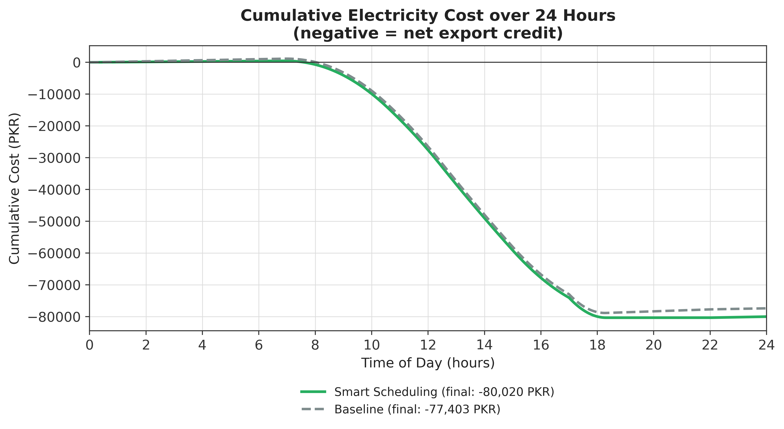
</p>

| Scenario | Daily Cost |
|----------|-----------:|
| Conventional Operation | −83,000 PKR |
| Smart EMS | −85,600 PKR |
| Improvement | ≈3% |

Although the simulated household benefits from a large photovoltaic installation, the intelligent controller still achieves measurable cost savings by coordinating battery storage and appliance scheduling.

Under more constrained operating conditions (smaller PV systems, reduced battery capacity, or higher electricity prices), even greater savings are expected.

---

# 📈 Overall System Performance

| Performance Metric | Result |
|--------------------|-------:|
| Installed PV Capacity | 520.3 kW |
| PV Strings | 44 |
| Inverter Stations | 3 |
| Battery Capacity | 2000 kWh |
| AC Output Power | ≈406 kW |
| Power Factor | ≈0.999 |
| MPPT Technique | Perturb & Observe |
| Battery Controller | Rule-Based EMS |
| Electricity Tariff | Time-of-Use |
| Daily Cost Reduction | ≈3% |

The simulation demonstrates the successful integration of renewable generation, battery storage, intelligent control, and energy management within a unified MATLAB/Simulink framework.
# 🏆 Key Findings

This project demonstrates the successful design, implementation, and verification of a utility-scale photovoltaic microgrid using MATLAB/Simulink and Simscape Electrical.

The major engineering findings include:

- Successfully designed a **520.3 kW photovoltaic generation system** using real manufacturer PV module parameters.
- Implemented a custom **Perturb & Observe (P&O) Maximum Power Point Tracking (MPPT)** controller capable of tracking maximum power under changing irradiance conditions.
- Verified the **DC–DC boost converter** using theoretical equations and identified an initial Discontinuous Conduction Mode (DCM) issue, which was corrected through inductor redesign.
- Developed a **three-phase Voltage Source Inverter (VSI)** with LC filtering for AC power conversion.
- Validated AC-side measurements using independent theoretical calculations.
- Designed a **2000 kWh Battery Energy Storage System (BESS)** with State of Charge (SOC) monitoring.
- Developed a rule-based **Energy Management System (EMS)** incorporating Time-of-Use electricity pricing and intelligent appliance scheduling.
- Demonstrated cost reduction using battery storage and tariff-aware scheduling.
- Investigated grid synchronization challenges and documented engineering limitations for future development.

---

# 🔬 Research Contributions

Unlike many simulation-only projects, this work follows a structured engineering workflow emphasizing validation and verification.

Major research contributions include:

- Utility-scale PV system modeling.
- Real-world PV module parameter implementation.
- Custom MPPT controller development.
- Verification-first engineering methodology.
- Independent subsystem validation.
- Practical fault diagnosis and corrective design.
- Battery Energy Management System development.
- Time-of-Use tariff optimization.
- Intelligent residential appliance scheduling.
- Comprehensive technical documentation suitable for academic and industrial applications.

---

# ⚠️ Known Limitations

The project intentionally documents existing limitations rather than hiding them.

Current limitations include:

- Grid synchronization using a dedicated Phase-Locked Loop (PLL) has not yet been implemented.
- DC-to-AC conversion efficiency can be further improved through optimization of filter and transformer parameters.
- Battery degradation and aging effects are not considered.
- Weather forecasting has not been integrated into EMS decisions.
- The EMS uses a rule-based strategy rather than predictive optimization.
- Harmonic analysis follows standard Simscape capabilities but does not include advanced power quality assessment.

These limitations provide opportunities for future research and development.

---

# 🚀 Future Work

Potential future improvements include:

- Phase-Locked Loop (PLL) based grid synchronization.
- Grid-forming inverter implementation.
- Advanced MPPT algorithms such as Incremental Conductance or AI-based MPPT.
- Lithium-ion battery degradation modeling.
- Model Predictive Control (MPC) for energy management.
- Machine Learning based energy forecasting.
- Weather prediction integration.
- Electric vehicle Vehicle-to-Grid (V2G) capability.
- Hydrogen energy storage.
- SCADA integration.
- IoT-enabled monitoring.
- Real-time Hardware-in-the-Loop (HIL) testing.
- Digital Twin implementation.
- Cybersecurity for smart microgrids.

---

# 📂 Repository Structure

```text
PV-Solar-Simulink-520kW
│
├── Image.png
├── 00_cover_icon.png
├── 01_pv_vs_load.png
├── 02_tariff.png
├── 03_battery_soc.png
├── 04_grid_import.png
├── 05_cost_comparison.png
├── 06_appliance_schedule.png
├── 07_single_chain_topology.png
├── 08_plant_architecture.png
├── 09_ems_architecture.png
├── 10_flowchart_mppt.png
├── 11_flowchart_ems_logic.png
├── 12_flowchart_signal_flow.png
│
├── PV_Microgrid_EMS_Technical_Report.pdf
├── README.md
│
└── models
      ├── pv_520kw_microgrid.slx
      └── ems_battery_scheduler.slx
```

---

# 🛠️ Software Requirements

The project was developed using:

| Software | Version |
|-----------|----------|
| MATLAB | R2023a or later |
| Simulink | Included |
| Simscape Electrical | Required |
| Specialized Power Systems | Required |

---

# ▶️ Running the Models

Open MATLAB and execute the following commands:

```matlab
% Open the PV Microgrid Model

open_system('models/pv_520kw_microgrid.slx')

% Open the Energy Management System

open_system('models/ems_battery_scheduler.slx')
```

Run the simulations directly from Simulink.

---

# 📄 Technical Report

A comprehensive technical report accompanies this repository.

The report includes:

- Introduction
- Literature Review
- PV System Design
- Component Selection
- MPPT Algorithm
- Converter Design
- Inverter Design
- Battery Energy Storage
- Energy Management System
- Mathematical Verification
- Simulation Results
- Discussion
- Limitations
- Future Work
- References

📄 **File**

```
PV_Microgrid_EMS_Technical_Report.pdf
```

---

# 💻 Technologies Used

- MATLAB
- Simulink
- Simscape Electrical
- Specialized Power Systems
- Renewable Energy Systems
- Power Electronics
- Smart Grid
- Battery Energy Storage
- Control Systems
- Microgrid Engineering

---

# 🔑 Keywords

Photovoltaic System • Solar Energy • Renewable Energy • Power Electronics • Smart Grid • MATLAB • Simulink • Simscape Electrical • Microgrid • MPPT • Boost Converter • Three-Phase Inverter • Battery Energy Storage System • Energy Management System • Smart Home • Time-of-Use Tariff • Control Systems • Electrical Engineering

---

# 👨‍💻 Author

## Muhammad Umer Mujahid

**Executive Maintenance Engineer**  
**ACM Group of Industries**  
Haripur, Khyber Pakhtunkhwa, Pakistan

### Areas of Interest

- Power Systems
- Renewable Energy
- Smart Grids
- Solar PV Systems
- Battery Energy Storage
- Artificial Intelligence
- Machine Learning
- Control Systems
- Industrial Automation
- Electrical Machines
- Power Electronics

---

# 🤝 Acknowledgements

Special thanks to **Faiz Sardar** for his valuable support, technical discussions, and collaboration during the development of this project.

His contributions and encouragement are sincerely appreciated.

---

# 📜 License

This repository is intended for **academic, educational, and research purposes**.

You are welcome to:

- Study the project.
- Learn from the implementation.
- Cite this work in academic research.
- Build upon the methodology with appropriate attribution.

Please provide proper credit if substantial portions of this work are used in research or publications.

---

# ⭐ Support the Project

If you found this repository helpful:

⭐ Star the repository

🍴 Fork the project

📄 Read the technical report

💬 Share feedback

🤝 Collaborate on future renewable energy and power systems research

---

<p align="center">

**Designed and Developed by Muhammad Umer Mujahid**

*Electrical Engineer | Power Systems | Renewable Energy | Artificial Intelligence | Smart Grid Research*

</p>
